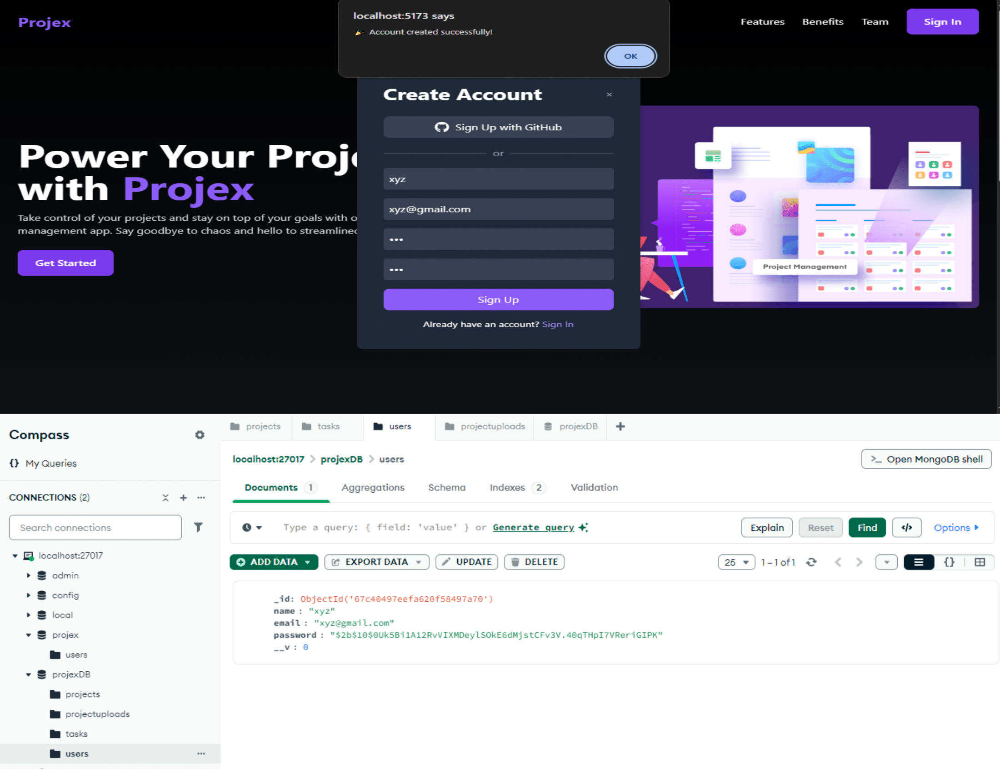
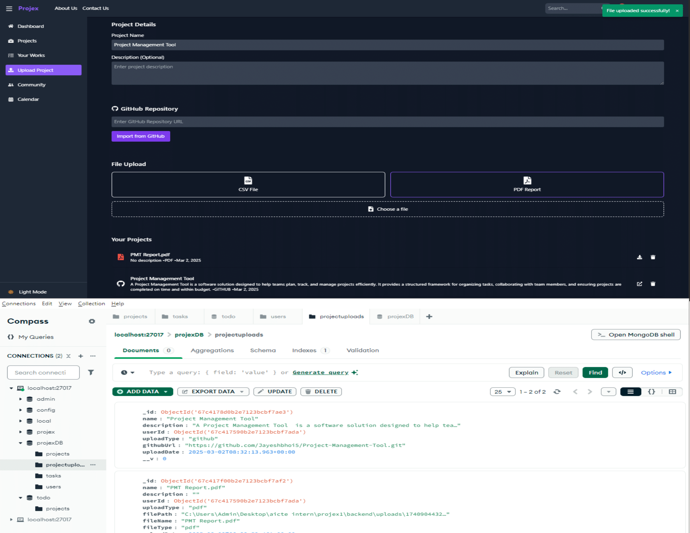

# 🚀 Projex - Project Management Tool (Backend)

Projex is a project management tool built using **Vite + React** for the frontend and a backend powered by **Node.js, Express, and MongoDB**. This README provides details about the backend, including API endpoints, authentication, and project management functionalities.

## ✨ Features
- 🔐 **User Authentication** (Email/Password & GitHub OAuth)  
- 📁 **Project Management** (Create, Update, Delete Projects)  
- 📌 **Task Board** (Manage Tasks in Requested, To-Do, In Progress, Done Columns)  
- 📤 **File Upload** (Import GitHub Projects, Upload CSV/PDF files)  
- 📅 **Team Collaboration Calendar** (Schedule events, client calls, deadlines, and meetings)  

## 🔗 API Endpoints

### 🔑 Authentication
-  `POST /api/auth/signup` - Register a new user  
-  `POST /api/auth/signin` - Sign in using email/password  
-  `GET /api/auth/github` - GitHub OAuth authentication  
-  `POST /api/auth/signout` - Logout user  

### 📂 Project Management
-  `GET /api/projects` - Fetch all projects  
-  `POST /api/projects` - Create a new project  
-  `PUT /api/projects/:id` - Update a project  
-  `DELETE /api/projects/:id` - Delete a project  

### ✅ Task Management
-  `GET /api/projects/:id/tasks` - Get tasks for a project  
-  `POST /api/projects/:id/tasks` - Add a task to a project  
-  `PUT /api/projects/:id/tasks/:taskId` - Update a task  
-  `DELETE /api/projects/:id/tasks/:taskId` - Delete a task  

### 📤 File Upload
-  `POST /api/upload/github` - Import a GitHub repository  
-  `POST /api/upload/file` - Upload CSV/PDF files  

### 🗓️ Calendar Events
-  `POST /api/calendar/add-event` - Add a new event  
-  `GET /api/calendar/events` - Get all scheduled events  
-  `DELETE /api/calendar/:id` - Remove an event  

## 📂 Project Overview

### 1️⃣ OAuth Authentication Page  
  
*🔑 User can sign in using Email/Password or GitHub OAuth.*  

### 2️⃣ Project Board  
  
*📌 Displays projects with tasks categorized into Requested, To-Do, In Progress, and Done.*  

### 3️⃣ Upload Project Section  
  
*📂 Allows users to import GitHub projects and upload CSV/PDF files with project details.*  

## 🛠️ Tech Stack

- 🟢 **Node.js** - Runtime environment  
- ⚡ **Express.js** - Backend framework  
- 🗄️ **MongoDB** - Database  
- 🔐 **OAuth** - GitHub authentication  
- 📦 **Multer** - File upload handling  

## ⚙️ Installation

```sh
# Clone the repository
git clone https://github.com/yourusername/projex-backend.git
cd projex-backend

# Install dependencies
npm install

# Setup environment variables
cp .env.example .env

# Start the server
npm start
